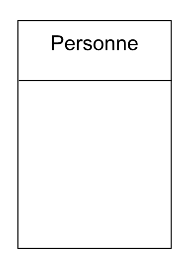
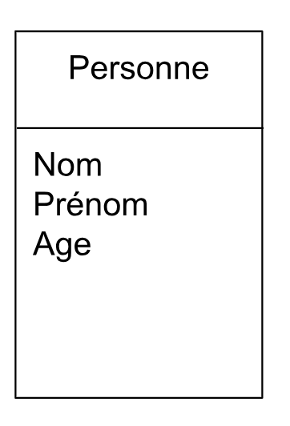
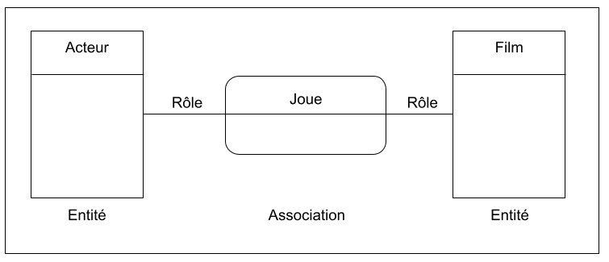
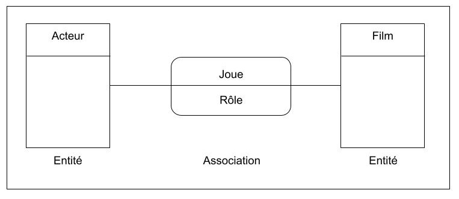
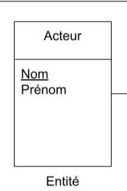

# 2.Merise : Modèle Conceptuel de Données (MCD)
Le modèle Conceptuel de Données **Entité** / **Association** repose sur les concepts :
- Entités
- Propriétés

Ce modèle est souvent nomme **Entité-Relation**

Cela permet de décrire un ensemble de données relatives à un domaine défini afin de les intégrer ensuite dans une Base de Données.

## A. Entité et Entité Type
|Entité|Entité Type|
|:----------|:---------------|
| Une entité est un objet, une chose concrète ou abstraite qui peut être reconnue distinctement. (ma voiture, ma maison, un pays et même Toi ). | Une entité type est la réprésentation communune que l'on adopte pour des entités qui possèdent les même caractéristiques. (Personne, voiture, région) |



## B. Propriétés (ou attributs)
Chacunes de ces entités sont constitués de **propriétés (ou attributs)**. Par exemple, pour notre nouvelle entité **Person**, celle-ci a pour attributs son `nom`,`prénom`, `age`, ...



## C. Association et Association Type
|Association|Association Type|
|:----------|:---------------|
|Il s'agit simplement d'un lien entre plusieurs entités |Répresentation d'un ensemble de relations qui possèdent les même caractéristiques, lien entre plusieurs entités type. (Ex: Le mariage de deux personnes).|

Ces associations sont reliés entre elles par un **verbe** d'action ou d'état (être, paraître sembler, ...)



**Rôle** est une donnée élémentaire de l'association (ou d'une entité). En effet, Un attribut propre à l’association est un attribut qui ne peut appartenir à aucune des entités qu’il relie individuellement, mais qui caractérise spécifiquement leur relation.



#### Comment identifier un attribut propre à l’association ?
Lors de la conception du **MCD**, on peut se poser ces trois questions clés :

L'attribut appartient-il naturellement à une seule entité ?
- Si oui, il doit rester dans l'entité.
- Ex : "Nom_Acteur" appartient à ACTEUR, pas à l'association.

L’attribut caractérise-t-il la relation entre les entités ?
- Si oui, il appartient à l’association.
- Ex : "Rôle" ne caractérise ni ACTEUR ni FILM seul, mais leur relation.

Si l’association disparaît, l’attribut a-t-il encore un sens ?
- Si non, c’est un bon indice que l’attribut appartient à l’association.
- Ex : "Date_Emprunt" n’a de sens que si l’association "emprunte" existe entre un ÉLÈVE et un LIVRE.


## D. Identifiant
Chaque **Entité** doit être identifié de manière *unique*; clé naturelle. En effet, l'identifiant est une valeur qui identifie sans ambiguïté une entité. Elle est généralement souligné.



Maintenant que vous savez créer des associations entre différentes entités, il est temps de passé aux relations. Il existe plusieurs types de relations. 

## E. Relations
#### 1. Relation binaire
Une association entre deux entités. Prenons pour exemple:

```markdown
Un étudiant possède un diplomé
```

- **Entité étudiant** : (Nom, Prénom et Naissance)
- **Entité diplome** : (Titre, Niveau)
- **Association** : possède (année, mention)

Soit analysons les deux relations:

- Un étudiant possède **0:n** diplôme(s) => zéro ou plusieurs 
- Un diplôme est possédé par **1:n** étudiants => un ou plusieurs

**FAIRE LE MODEL**

#### 2. Partage d'une même collection
**Une collection** est l'ensemble des participants d'une association

```markdown
Une personne possède ET/OU habite dans une maison
```

- **Entité étudiant** : (Nom, Prénom et Naissance)
- **Entité diplome** : (Titre, Niveau)
- **Associations** : Habiter ET posseder

Analysons les relations:

- Une personne possède **1:1** logement => un et un
- Une personne habite **1:n** logement => un et plusieurs
- Un logement est possédé par **0:n** personne(s)=> zéro et plusieurs
- Un logement est habité par **1:n** personne(s) => un et plusieurs 

**FAIRE LE MODEL**

#### 3. Relation sur une même entité: soit une relation 1-aire, entité récursive
```markdown
Un employé est supervisé par une employé
```

Etrange que cela soit, c'est une entité très intéressante. En effet, on pourrait transposer ce modèle sur d'autres exemple, comme:

- Des commentaires d'un blog, on des sous commentaires
- Des catégories d'articles, peuvent avoir des sous catégories

Dans ce cas, on appelle cela des entité récurcives.

Analysons

- **Entité employé** : (Nom, Prénom et Naissance)
- **Associations** : Supervision

Soit

- Un employé est supervisé par **0:1** superviseur
- Un superviseur supervise **0:n** employé.

**FAIRE LE MODEL**

#### 4. Relation n-aires
Association entre au moin trois entités (ternaire)

**FAIRE LE MODEL**